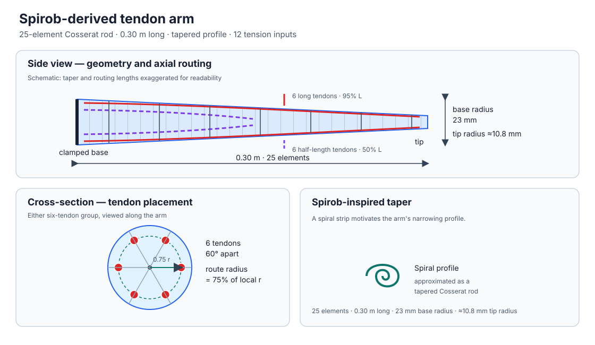

# Spirob tendon-arm reaching

`TendonArmReach-v0` and `TendonArmReach-v1` are Gymnasium tasks for controlling
a tendon-driven, Spirob-inspired continuum arm. The arm is a 0.30 m tapered
Cosserat rod with 12 tension inputs. It is clamped at the base and initially
hangs downward. v0 is a fixed-target reaching task; v1 tracks a moving
figure-eight target.

The geometry is derived from the outer spiral of a Spirob arm and represented
as a straight, tapered rod. The schematic shows the spiral-profile idea, the
arm dimensions, and the tendon layout. Six tendons are spaced at 60-degree
intervals around each cross-section; their routing radius is 75% of the local
arm radius. One group runs to 95% of the arm and the other to 50%. The two
groups share idealized routing lanes where they overlap.



## Tendon model

Actions prescribe tendon **forces (tensions)**, not tendon displacement or
motor position. At each routing contact, the change in tendon direction
produces a force on the rod; the offset from the centerline also produces a
moment. This provides distributed tendon actuation while avoiding a detailed
motor, pulley, or tendon-dynamics model.

The current model assumes massless, inextensible tendons with instantaneous,
uniform nonnegative tension along each route. Slack, pretension, friction, and
contact wear are not modeled. A more systematic muscle model is a future
direction; see the [octopus-muscle crawling environment](octopus_muscle.md) for
the related muscle-driven arm task.

## Actions and observations

The action space is `Box(0, 1, shape=(12,), dtype=float32)`. The first six
values control the longer routes and the remaining six control the shorter
routes. Each value is scaled linearly to a tension from 0 to the default
maximum of 55.2 N. This is a simulation calibration, not a hardware-safe force
recommendation. The arm model uses a fixed 25-element mesh and fixed simulation
time step; each action advances approximately 1/30 second of simulated time.

The observation is a 125-value `float32` vector: five frames of tip-position
and tendon-tension history, target and target-relative position, tip velocity
and speed, plus sampled rod-node positions and speeds. `stack_frame` can be
changed from its default of 5, which changes the observation length to
`15 * stack_frame + 50`.

## Targets, episodes, and reward

By default, reset samples a target from a cylindrical region near the hanging
tip (lateral radius at most 10 cm, vertical position from -26 to -20 cm). Use a
seed for repeatable target sampling, or supply a target for a particular
episode:

```python
observation, info = env.reset(
    seed=1,
    options={"target": [0.02, -0.20, -0.03]},
)
```

Episodes last 6 seconds, or 180 control steps at the default control rate.
Reaching the time limit sets `truncated=True`. An invalid simulation state or
control collapse sets `terminated=True`; `info["termination_reason"]` reports
the cause.

The reward favors proximity and settling, with no progress-shaping or
tendon-effort term:

```{math}
r_t = -d_t
- \lambda_v \max\left(0, 1 - \frac{d_t}{d_{\mathrm{gate}}}\right)
  \left(\frac{v_t}{v_{\mathrm{ref}}}\right)^2
- 50\,\mathbf{1}_{\mathrm{failure}}.
```

Here, $d_t$ is tip-to-target distance and $v_t$ is tip speed. The speed penalty
only applies within a 3 cm target gate, encouraging the arm to settle after
reaching the target. Reward components and tip speed are returned in `info`.

## Gymnasium example

```python
import gymnasium as gym
import gym_softrobot

env = gym.make("TendonArmReach-v0")
observation, info = env.reset(seed=1)

terminated = truncated = False
while not (terminated or truncated):
    action = env.action_space.sample()
    observation, reward, terminated, truncated, info = env.step(action)

env.close()
```

## Moving-target tracking (v1)

v1 moves the target along a figure eight centered at `(0, -0.26, 0)` m, with
default half-width 6 cm, half-height 4 cm, and an 8-second period. Each reset
randomizes the starting phase (reproducibly with `seed`); pass
`options={"phase": 0.0}` to choose a specific phase. Episodes last two target
cycles by default. The observation adds the target's 3-D velocity to v0's
state, and the near-target settling penalty uses tip velocity relative to
target velocity. This gives the policy both position and direction/speed cues
for closed-loop interception and tracking.

```python
env = gym.make("TendonArmReach-v1")
observation, info = env.reset(seed=1)
observation, reward, terminated, truncated, info = env.step(env.action_space.sample())
env.close()
```

## PPO example

Install Stable-Baselines3 in the environment where `gym-softrobot` is
installed, then train and visualize a policy:

```bash
uv pip install stable-baselines3
python examples/tendon_arm_reach/train_ppo.py --timesteps 4096
python examples/tendon_arm_reach/visualize_policy.py \
  save/tendon_arm_reach/final_model.zip \
  --video save/tendon_arm_reach/policy.mp4
```

Training saves a PPO model, observation/reward normalization statistics,
checkpoints, logs, and a progress plot under `save/tendon_arm_reach/`. Keep the
normalization statistics alongside the model for replay. This script is a
minimal integration example, not a guarantee that PPO will solve the reaching
task; use the reported target distance to evaluate a run.
